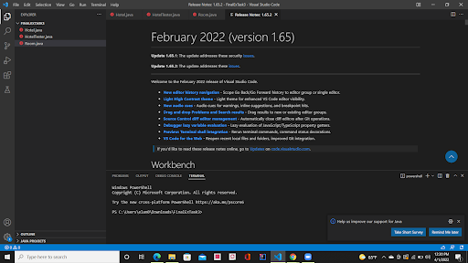
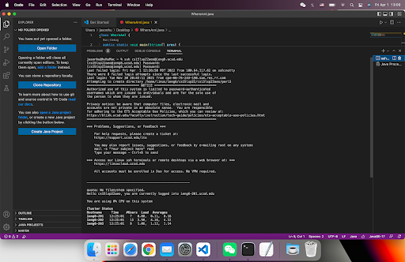
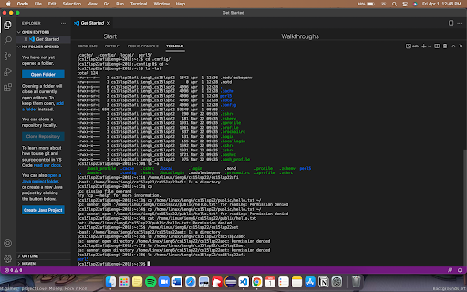
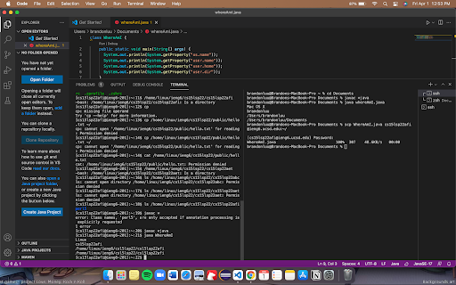
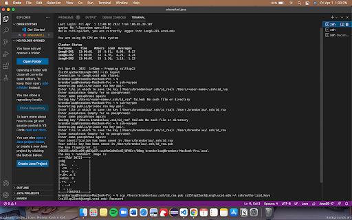

# Week 2 Lab Report

## Installing VScode
The beginning of this lab we were required to download VScode. To do this we went to the [VScode website](https://code.visualstudio.com/). Once there we download the version for our specific operating system. When the download finishes and it is installed it should look like this:

## Remotely Connection
The next part of the lab we connected to the server with our course specific accounts. We looked up our accounts at [this website](https://sdacs.ucsd.edu/~icc/index.php) and used the ssh command in the terminal.

## Run Some Commands
Here we tried out some commands to get some familiarity with the terminal and terminal commands. Here are some of the commands we tried:
* `cd`
* `ls -lat`
* `cp /home/linux/ieng6/cs15lsp22/public/hello.txt`

To exit the terminal and server you can type `exit`.

## Moving Files with `scp`
During this part of the lab our goal was to transfer a file make on client side to the server we ssh into. To start this we create a file on our client with some code inside. Then we did 

`scp WhereAmI.java cs15lsp22zz@ieng6.ucsd.edu:~/`

Once this is done the file should be copied over to the server.

## Setting an SSH Key
In the next part of the lab we aim to streamline the process of logging into the server. To remove the step of entering your password everytime we try to login or use `scp` we create a key that is connected between the client and server. Once we use `ssh-keygen` to create the key with no password, we copy the public key to the server.

## Optimizing Remote Running 
This last part of the lab we tried new things to see what would make our life easier when working with the `ssh` command. One thing that was useful was that we could wrap commands in quotes when executing the `ssh` command and it will directly run that command. For example: 

`ssh cs15lsp22zz@ieng6.ucsd.edu "ls"`

