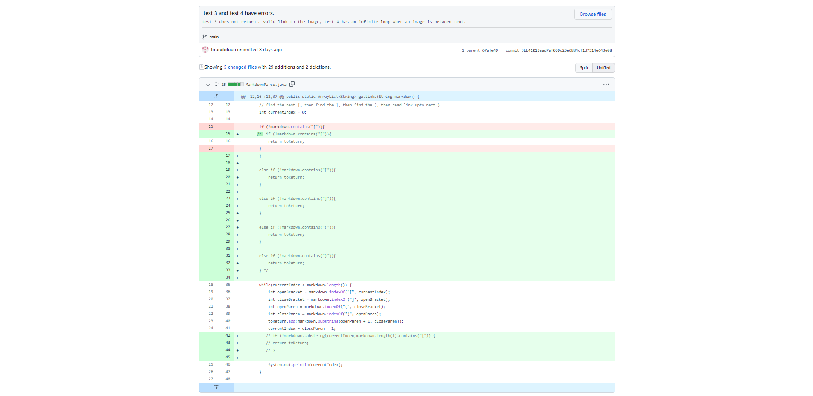
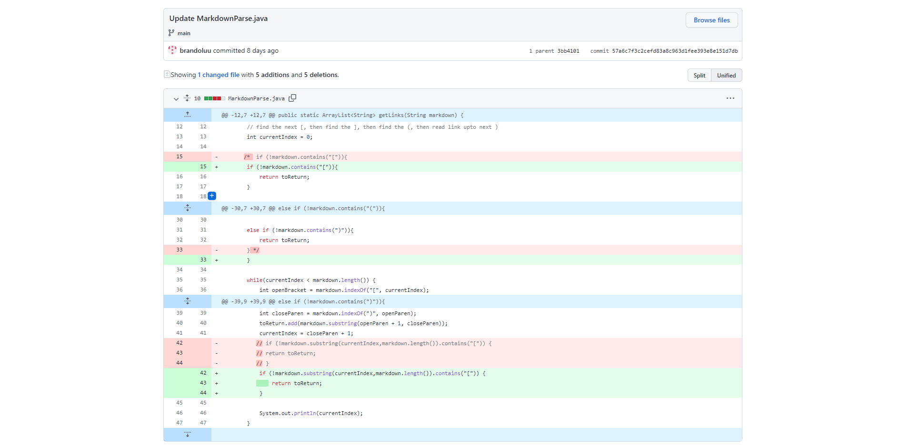

# Week 4 Lab Report 2

## Code Change 1

This first [code change](https://github.com/brandoluu/markdown-parser/commit/f44ffe3287744496674e448d201c023eb187b4f9) dealt with a String index out of bounds error.

As you can see in the commit message, the symptom of this file throws a String index out of bounds exception. We updated the code to support a file with no links.

## Code Change 2

The second [code change](https://github.com/brandoluu/markdown-parser/commit/3bb41013aad7af059c25e6884cf1d7514e643e08) we made was for two symptoms that were connected. 

The two errors that we encountered were an image link not being returned and an infinite loop when a link was in between text. To solve this issue we checked to make sure we have each indicator; [ , ] , ( , )

## Code Change 3

The third [code change](https://github.com/brandoluu/markdown-parser/commit/57a6c7f3c2cefd83a8c963d1fee393e8e151d7db) we fixed another infinite loop.

This error was caused by a file that starts off normally but then ends with a missing parenthesis. This would cause the loop to run infinitely because it continues to look for a closing parenthesis that doesn't exist. To fix this, we check for a close parenthesis after creating a substring starting from the current index.
