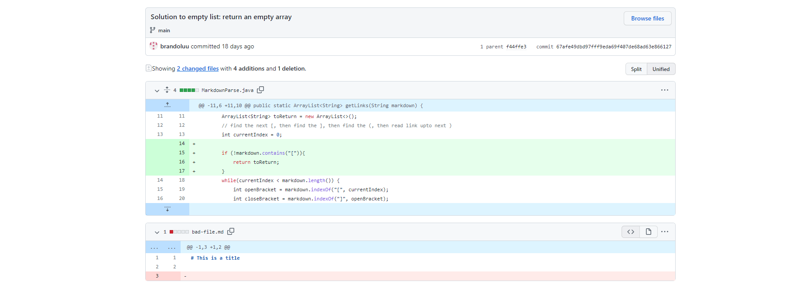
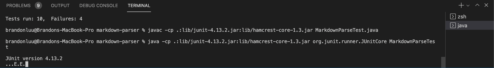
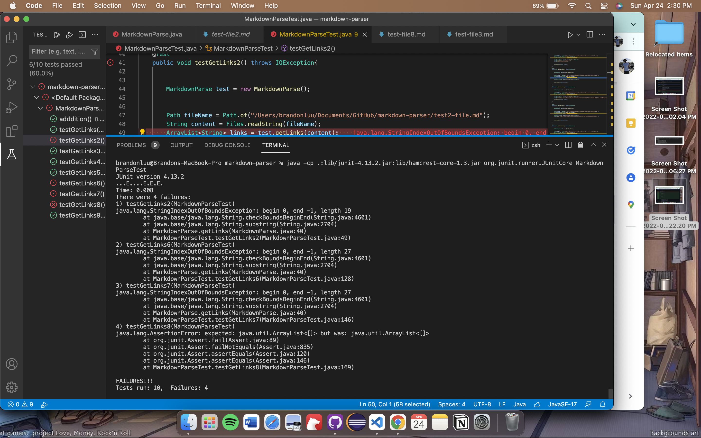
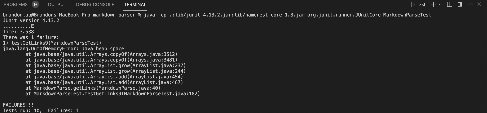

# Week 4 Lab Report 2

## Code Change 1

This first [code change](https://github.com/MikayelSughyan/markdown-parser/blob/main/test2-file.md) dealt with an infinite loop caused by unfinished implementation.

As you can see in the commit message, the symptom of this file throws a String index out of bounds exception. We updated the code to support a file with no links.

## Code Change 2

The second [code change](https://github.com/MikayelSughyan/markdown-parser/blob/main/test4-file.md) we made was for two symptoms that were connected. 

This was also an issue of index out of bounds for not having certain brackets or parenthesis.

The two errors that we encountered were an image link not being returned and an infinite loop when a link was in between text. To solve this issue we checked to make sure we have each indicator; [ , ] , ( , )

## Code Change 3

The third [code change](https://github.com/MikayelSughyan/markdown-parser/blob/main/test-file8.md) we fixed another infinite loop.

This error was caused by a file that starts off normally but then ends with a missing parenthesis. This would cause the loop to run infinitely because it continues to look for a closing parenthesis that doesn't exist. To fix this, we check for a close parenthesis after creating a substring starting from the current index.
