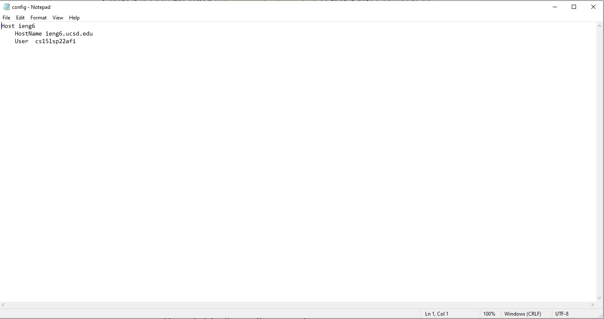
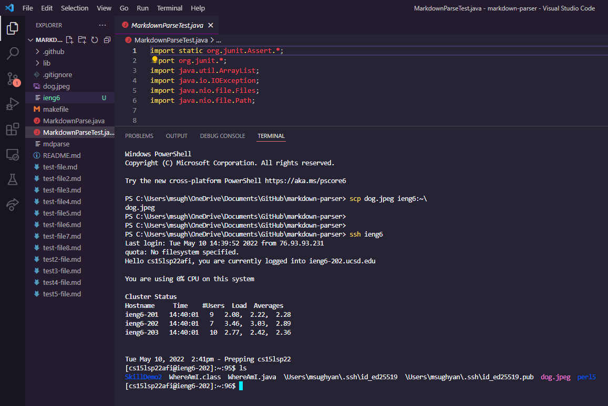
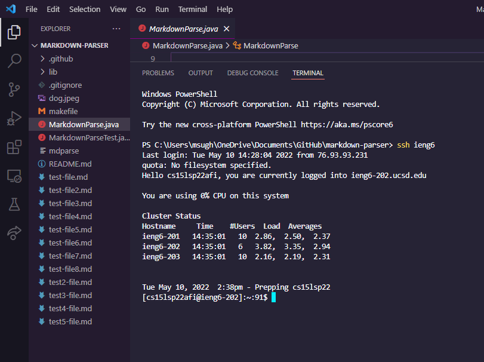
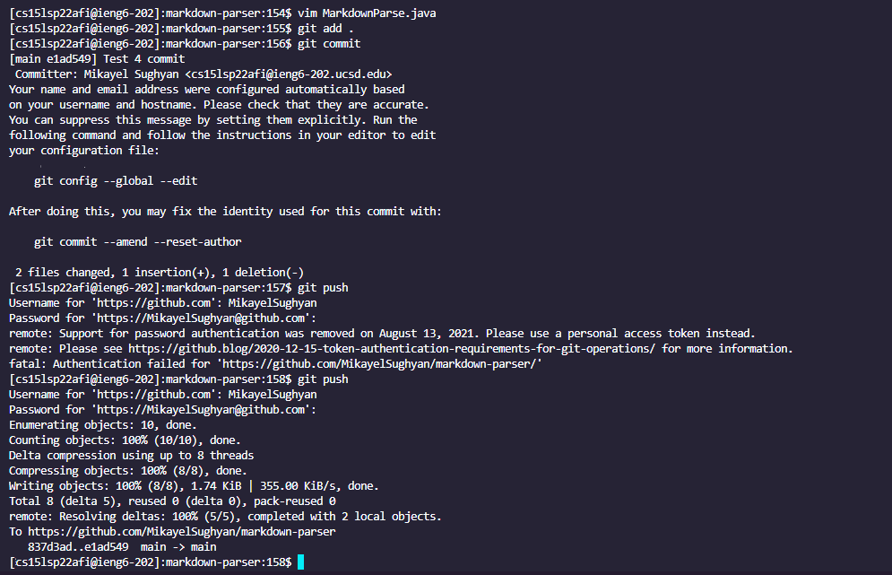
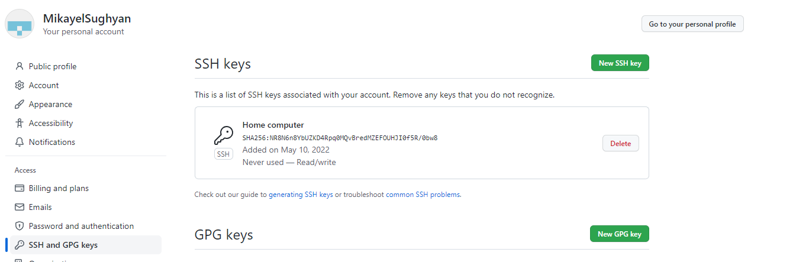
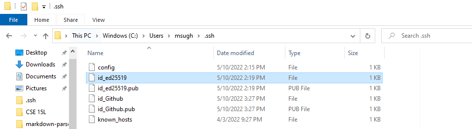
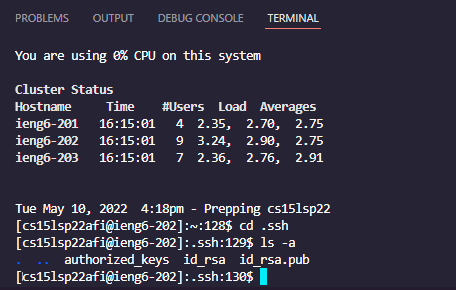
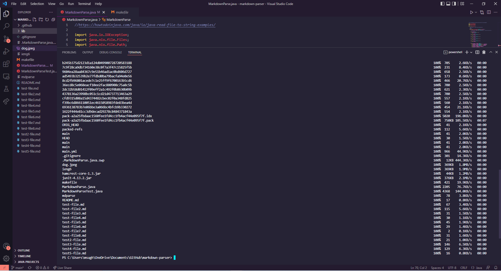
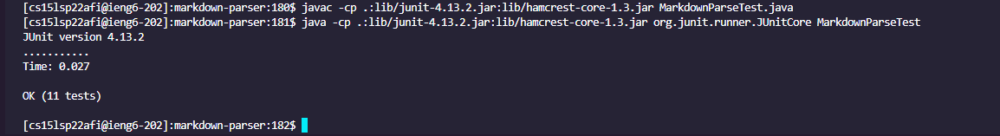
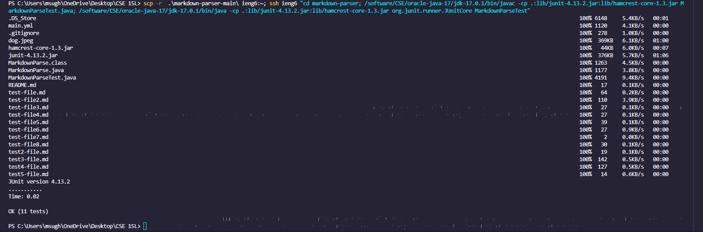

# Week 6 Lab Report 3

# Group Choice 1
The first group choice goal was to be able to shorten the lengthy login criteria. At first I had to enter in

`ssh cs15lsp22afi@ieng6.ucsd.edu`

but then after we added a config file to the .ssh folder and configured it according to the lab writeup we are able to login via

`ssh ieng6`

significantly shortening the username to enter. Now we can copy files, for example, in a quicker manner.

# Group Choice 2

The second group choice had to do with setting up Github access from ieng6. To do this we had to create an RSA key on the ieng6 server and then copy the public key to add to our Github account. By doing this, we are now able to commit and push files that we have edited on the server to our Github repository.

Here we show that committing and pushing while on the ieng6 server works.

Here we show the public key we put into our Github account.

Here we show where the private key is stored.

Here we show where the private key is stored on the ieng6 server.

# Group Choice 3

The third and final group choice was to show how we can recursively copy entire directories onto the ssh server as well combine that with running all in one line.

Here is a photo that shows that I copied the directory into the server.

Next screenshot shows compiling and running the files on the server

This final screenshot shows copying the directory and compiling/running in one line
