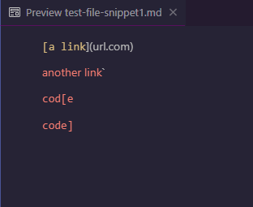
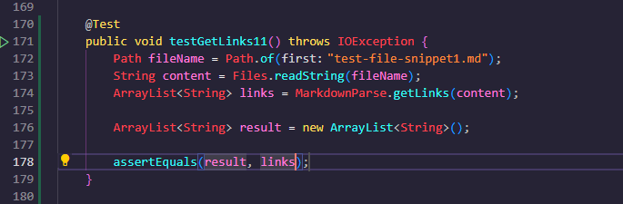
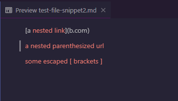
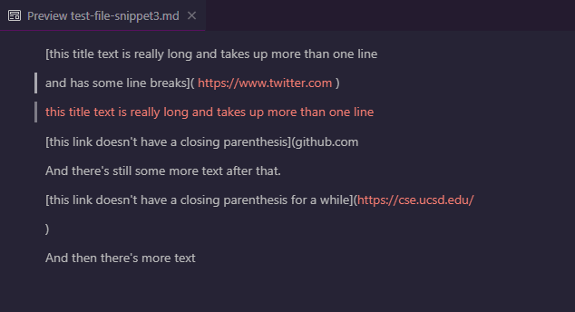

# Lab Report 4 Week 8
//add link to my repository

//add link to other repository

## Snippet 1

The test should produce an empty array list according to VScode preview

## Snippet 2

This test should produce an array list with 3 links:

The first link is `a.com`.

The second link is `a.com(())`.

The third link is `example.com`.

## Snippet 3

This test should produce an array lis with 1 link.

The link should be `https://sites.google.com/eng.ucsd.edu/cse-15l-spring-2022/schedule`.

