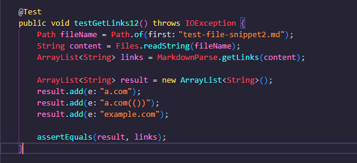

# Lab Report 4 Week 8
[Link to my respository](https://github.com/MikayelSughyan/markdown-parser)

[Link to the reviewed repository.](https://github.com/ohuynh21/markdown-parser)

## Snippet 1

The test should produce an array list with 3 links:

The first link is `google.com

The second link is `google.com`

The third link is `ucsd.edu`

## Snippet 2

This test should produce an array list with 3 links:

The first link is `a.com`.

The second link is `a.com(())`.

The third link is `example.com`.

## Snippet 3

This test should produce an array lis with 3 links.

The first link should be  `https://www.twitter.com`

The second link should be `https://sites.google.com/eng.ucsd.edu/cse-15l-spring-2022/schedule`.

The third link should be `https://cse.ucsd.edu/`

Here is what happens when I run each test on my code.

The first test doesn't pass because it recognizes the url.com as a valid link even though it is not a valid link.

The second test doesn't pass because the second link should include all four of the parenthesis but the actual output does not.

The third test doesn't pass because the extra spaces causes the code to include more than it should.

Here is what happens when I run each test on the others groups code.

You can notice that the results are identical and thus the reasons for their failures are similar in scope.

# Questions to Answer

I think there is a way to add less than 10 lines of code to take into account the case of inline code with backticks. We would need to check to see if cuts off a bracket or parenthesis that is essential to creating a link. That is when a bracket or parenthesis falls between backticks and there is no other bracket or parenthesis to complete the syntax.

I think solving the issue of nest parentheses, brackets, and escaped brackets is more of an involved change and would require more than 10 lines of code to fix. The issue here lies in determining when the final bracket or parenthesis should be considered. In the case of the second link in the second snippet, the code moves on once it hits the first close parenthesis it sees when it should continue to the final close parenthesis.

I also think that solving the issue of the case with new lines in brackets and parentheses would be more involved. This would require us to look out for new lines at every moment. Since the markdown file is read through as one long string, we would need to filter out new lines which might take more than 10 lines of code.