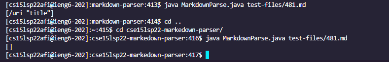

# Lab Report 5 Week 10

For our final lab report we were assigned with finding a test file that has different outputs between our markdown parse implementation and the implementation that was provided. I used vimdiff to look through the two different result.txt files and see which tests produced different outputs. 

Here are the screenshots of me using vimdiff to find the respective files that produced different outputs. This is the [link](https://github.com/nidhidhamnani/markdown-parser/blob/main/test-files/488.md) to the first file. This is the link to the [second](https://github.com/nidhidhamnani/markdown-parser/blob/main/test-files/481.md) file.

The implementation provided by the lab is the correct one and produces the correct output. 

These two screenshots show that the link should be valid by the VScode preview screen although if we look at the link itself in the markdown files, they are not valid links and thus should not be added to the arraylist.

These two screenshots show the outputs of both tests within my implementation and the implementation provided by the lab writeup. The output I expect is an empty Array but my implementation returns the invalid url. Although we can also interpret the opposite as being true. The format of the brackets and parenthesis is technically correct, which would mean my implementation returns the correct output. The issue here is the greater sign which has a function is the markdown language. For the test that utilizes the greater sign in the link between the parenthesis, it would mean that the link is invalid and thus nothing should be returned. A fix to this bug could be checking the for other markdown operators within the link itself or to check that the link ends with .com or another .something url.

